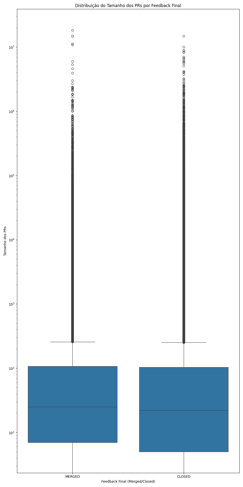

# Análise de Code Reviews em Repositórios Populares do GitHub

Daniel Leão, Juliana Serra e Letícia Fraga

## Introdução

Este trabalho tem como objetivo analisar as variáveis que influenciam o merge de um pull request (PR) em repositórios populares do GitHub. Para isso, focamos em PRs que passaram por processos de revisão manual, excluindo revisões automáticas de bots e ferramentas de CI/CD. As questões de pesquisa analisam como o tamanho, o tempo de análise, a descrição e as interações nos PRs influenciam o status final e o número de revisões realizadas.

### Hipóteses Iniciais

- H1: PRs maiores (com mais arquivos e linhas modificadas) tendem a receber feedback mais negativo e requerem mais revisões.
- H2: PRs com tempo de análise maior (duração desde a submissão até o fechamento) tendem a ter feedbacks mais negativos e um número maior de revisões.
- H3: PRs com descrições mais detalhadas (maior número de caracteres) tendem a ter um feedback positivo e necessitam de menos revisões.
- H4: PRs com mais interações (comentários e participantes) têm uma maior chance de ser aceitos (merged) e passam por menos revisões.

## Metodologia

1. **Criação do Dataset:**
   - Foram selecionados os 200 repositórios mais populares do GitHub, considerando apenas aqueles com pelo menos 100 PRs (merged + closed).
   - Selecionamos PRs com status MERGED ou CLOSED e com pelo menos uma revisão registrada.
   - PRs que levaram menos de uma hora entre submissão e conclusão foram excluídos.

2. **Questões de Pesquisa:**
   - **RQ1:** Qual a relação entre o tamanho dos PRs e o feedback final das revisões?
   - **RQ2:** Qual a relação entre o tempo de análise dos PRs e o feedback final das revisões?
   - **RQ3:** Qual a relação entre a descrição dos PRs e o feedback final das revisões?
   - **RQ4:** Qual a relação entre as interações nos PRs e o feedback final das revisões?
   - **RQ5:** Qual a relação entre o tamanho dos PRs e o número de revisões realizadas?
   - **RQ6:** Qual a relação entre o tempo de análise dos PRs e o número de revisões realizadas?
   - **RQ7:** Qual a relação entre a descrição dos PRs e o número de revisões realizadas?
   - **RQ8:** Qual a relação entre as interações nos PRs e o número de revisões realizadas?

3. **Métricas Definidas:**
   - **Tamanho:** Número de arquivos modificados e total de linhas adicionadas/removidas.
   - **Tempo de Análise:** Intervalo de tempo entre a submissão do PR e seu fechamento ou merge.
   - **Descrição:** Número de caracteres no corpo da descrição do PR.
   - **Interações:** Número de participantes e comentários em cada PR.

## Resultados

### RQ 01: Qual a relação entre o tamanho dos PRs e o feedback final das revisões?
**Gráfico**: Boxplot comparando o tamanho dos PRs com o feedback final ("Merged" ou "Closed").

- **Interpretação**:  
  - A mediana do tamanho dos PRs é semelhante entre os grupos "Merged" e "Closed".
  - A dispersão dos tamanhos e a presença de outliers são próximas para ambos os grupos.  
  
**Conclusão**: O tamanho do PR, por si só, não parece ser um fator determinante para o feedback final (mescla ou fechamento). Embora a expectativa inicial fosse que PRs menores seriam mais facilmente mesclados, a análise sugere que o tamanho por si só não é um fator decisivo para o feedback final. Ambos os PRs **Merged** e **Closed** apresentaram uma distribuição de tamanhos semelhante, com outliers em ambas as categorias. Isso pode indicar que a qualidade e a relevância das mudanças são mais influentes do que o tamanho bruto do PR. Assim, PRs grandes podem ser mesclados se bem justificados e pequenos podem ser rejeitados se não cumprirem os critérios esperados.

---

### RQ 02: Qual a relação entre o tempo de análise dos PRs e o feedback final das revisões?
**Gráfico**: Boxplot comparando o tempo de análise dos PRs com o feedback final.

- **Interpretação**:  
  - PRs mesclados tendem a ser analisados mais rapidamente do que os fechados.
  - A variação no tempo de análise é maior para PRs fechados, indicando maior complexidade ou indecisão.  
  
**Conclusão**: PRs que passam por análises rápidas têm maior chance de serem aprovados, enquanto análises prolongadas estão associadas a maior rejeição. Esse achado corrobora a hipótese de que revisores são mais rápidos em aceitar mudanças claras e diretas. Esse comportamento é coerente com práticas comuns em projetos colaborativos, onde a urgência ou simplicidade das mudanças pode agilizar a aceitação. Por outro lado, PRs que exigem mais tempo tendem a ser mais complexos ou gerar dúvidas, o que pode levar à rejeição ou adiamento da decisão final.

---

**Gráfico**: Boxplot comparando o tamanho das descrições dos PRs com o feedback final (Merged/Closed).  

- **Interpretação**:  
  - A mediana do tamanho das descrições dos PRs é semelhante entre os PRs que foram mesclados ("Merged") e os que foram fechados ("Closed").
  - A dispersão dos dados também é parecida entre os dois grupos, com uma faixa interquartil que sugere pouca variação entre PRs aceitos e rejeitados em termos de descrição.
  - Foram identificados diversos **outliers** em ambos os casos, representando PRs com descrições excepcionalmente grandes.

**Conclusão**:  
O tamanho da descrição dos PRs não parece influenciar diretamente o feedback final (se o PR será mesclado ou fechado). Tanto PRs mesclados quanto fechados apresentam distribuições semelhantes para o tamanho das descrições. Isso sugere que a decisão de aceitar ou rejeitar um PR pode depender mais de outros fatores (como o conteúdo da descrição ou a complexidade das mudanças) do que do tamanho da descrição em si.

---

### RQ 04: Qual a relação entre as interações nos PRs e o feedback final das revisões?
**Gráfico**: Boxplot comparando o número de interações (comentários, participantes) com o feedback final.

- **Interpretação**:  
  - A mediana e a variação das interações são semelhantes entre PRs "Merged" e "Closed".
  - PRs de ambos os tipos apresentam outliers, indicando que tanto PRs aprovados quanto rejeitados podem gerar discussões intensas.  
  
**Conclusão**: O número de interações não parece ser um fator decisivo para a aceitação ou rejeição de um PR. As interações também não mostraram uma correlação direta com o feedback final, contradizendo a expectativa inicial de que PRs com mais discussões tenderiam a ser mais aceitos. Tanto PRs mesclados quanto fechados apresentaram um número variado de interações, incluindo outliers com interações muito acima da média. Esse achado indica que, embora as interações possam ser indicativas de engajamento, elas não garantem a aprovação do PR.

---

### RQ 05: Qual a relação entre o tamanho dos PRs e o número de revisões realizadas?
**Gráfico**: Dispersão entre o tamanho dos PRs e o número de revisões.

- **Interpretação**:  
  - PRs de tamanho moderado recebem mais revisões.
  - PRs muito grandes ou pequenos tendem a ter menos revisões.  
  
**Conclusão**: PRs com complexidade intermediária parecem incentivar mais iterações de revisão. Esse achado é interessante, pois indica que PRs muito pequenos ou muito grandes recebem menos iterações de revisão. Isso pode acontecer porque PRs pequenos são frequentemente triviais, exigindo menos ajustes, enquanto PRs muito grandes podem ser desafiadores para revisores, reduzindo a quantidade de iterações possíveis.

---

### RQ 06: Qual a relação entre o tempo de análise dos PRs e o número de revisões realizadas?
**Gráfico**: Dispersão entre o tempo de análise e o número de revisões.

- **Interpretação**:  
  - PRs que levam mais tempo para serem analisados tendem a ter mais revisões.
  - A relação não é linear, sugerindo que outros fatores podem influenciar o número de revisões.  
  
**Conclusão**: PRs complexos (que exigem mais tempo de análise) tendem a necessitar de mais iterações de revisão. 

---

### RQ 07: Qual a relação entre a descrição dos PRs e o número de revisões realizadas?
**Gráfico**: Dispersão entre o tamanho da descrição e o número de revisões.

- **Interpretação**:  
  - PRs com descrições moderadas recebem mais revisões.
  - Descrições muito curtas ou muito longas reduzem o número de revisões.  
  
**Conclusão**: Descrições bem elaboradas, mas não excessivamente detalhadas, são mais eficazes para incentivar revisões. Um ponto relevante é que descrições muito curtas ou muito longas também não incentivam a realização de várias revisões. Uma explicação para isso pode ser que descrições curtas não fornecem detalhes suficientes para discussões aprofundadas, enquanto descrições excessivamente longas podem sobrecarregar os revisores e reduzir o engajamento.

---

### RQ 08: Qual a relação entre as interações nos PRs e o número de revisões realizadas?
**Gráficos**: Três dispersões mostrando a relação entre número de participantes, comentários e interações com o número de revisões.

- **Interpretação**:  
  - Mais participantes e comentários estão associados a mais revisões.
  - A relação apresenta um limite, onde mais interações não aumentam proporcionalmente o número de revisões.  
  
**Conclusão**: PRs amplamente discutidos tendem a passar por mais ciclos de revisão, mas existe um ponto onde a quantidade de interações deixa de influenciar significativamente. Os resultados relacionados às interações e ao número de revisões indicam que PRs com mais participantes e comentários tendem a ter mais iterações de revisão. No entanto, foi observado um limite para essa relação: após certo ponto, um maior número de interações não necessariamente leva a mais revisões. Isso sugere que há uma saturação no processo de revisão, onde um aumento nas interações não se traduz em mais iterações no código.

## Discussão e Conclusões Finais
Os resultados apresentados nos gráficos e a análise das RQs nos fornecem uma visão importante sobre como certos fatores afetam o processo de code review em repositórios populares do GitHub. Embora algumas relações esperadas tenham se confirmado, outras mostraram comportamentos mais complexos, o que abre espaço para reflexões sobre o impacto de tamanho, tempo de análise, interações e descrições dos PRs na aprovação ou rejeição de mudanças.

Os resultados deste estudo sugerem que a aprovação ou rejeição de PRs em projetos populares do GitHub é um processo influenciado por uma combinação de fatores. Embora atributos como tamanho, tempo de análise e número de interações desempenhem papéis importantes, eles não são isoladamente determinantes. O sucesso de um PR parece depender mais de fatores qualitativos, como a clareza das mudanças, a complexidade do código e a natureza das interações, do que de fatores puramente quantitativos.

Além disso, o estudo revelou que PRs de complexidade moderada, com descrições detalhadas e um tempo razoável de análise, são os mais revisados. Isso sugere que revisores preferem trabalhar com PRs que oferecem um equilíbrio entre simplicidade e profundidade, onde o esforço para entender e revisar é compensado pela relevância das mudanças.

